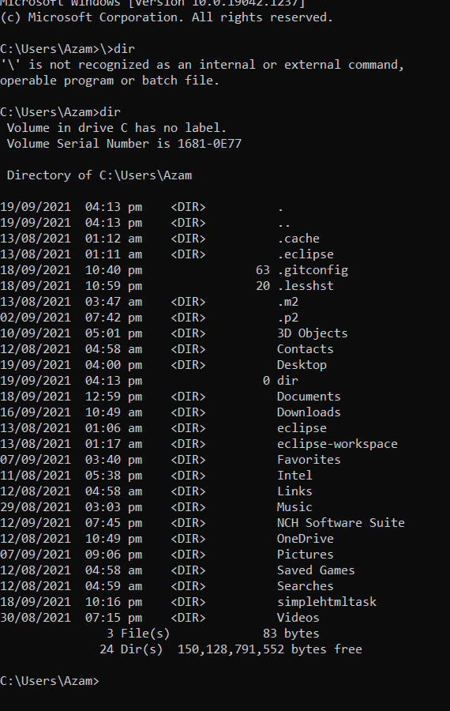

# Cmd-
`In this example, the dir command is used alone, without any drive:, path, filename specifications, nor any switches, producing a result like this`

As you can see, the dir command was executed from the [root directory](https://www.lifewire.com/what-is-a-root-folder-or-root-directory-2625989)
 of C (i.e.,C:\Users\Azam>dir). Without specifying where exactly to list the folder and file contents from, the command defaults to displaying this information from where the command was executed.
